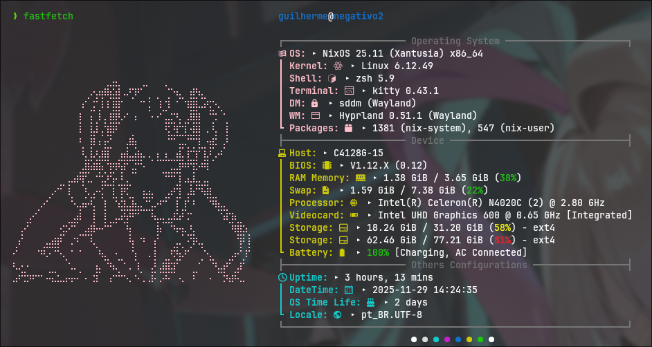

# KAngel Fastfetch



# INSTALLATION

## Requisits

* 

## Install

To install the fastfetch config, use:

```bash
git clone https://github.com/Vapor55/KAngel-Fastfetch-Dotfiles.git ~/.config/fastfetch
```

Optional: Remove the .git folder

```bash
rm -rf ~/.config/fastfetch/.git
```

# Waring

- Characters, images, and other visual elements related to *NEEDY STREAMER OVERLOAD* (such as Ame-chan / KAngel) are the property of their respective rights holders: Xemono / WSS playground / Alliance Arts, as applicable. No ownership of these materials is claimed. © Xemono / WSS playground / Alliance Arts.

- Images included in this repository are used solely to demonstrate the theme/appearance of the fastfetch setup and are not intended to infringe on any rights. If you are a rights holder and would like any material removed, please open an issue or submit a pull request requesting removal.

> Note: The license of this repository applies only to the code and files created by this author (MIT). It does not alter or grant rights over third-party materials included here.

# Credits

This fastfetch configuration is the modified version for [Sofijacom Dotfiles Fastfetch](https://github.com/sofijacom/dotfiles-fastfetch).
